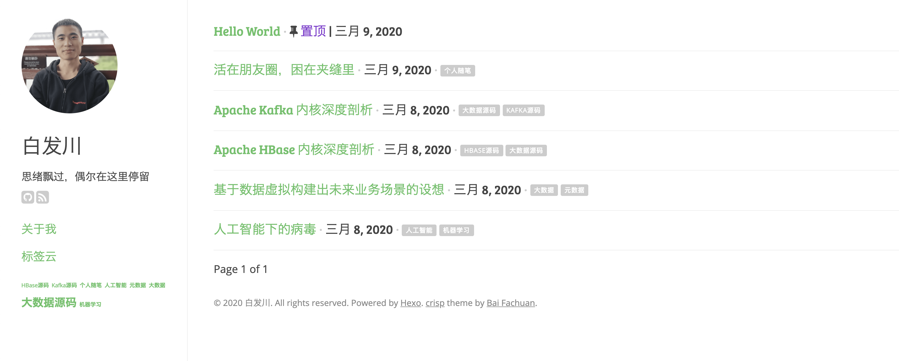

### 背景

本项目为hexo的主题，比较简洁，选择了很多都没有合适的，于是参考如下UI风格：

[点击进入](https://github.com/kathyqian/crisp-ghost-theme)

和部分其他实现，修改形成了该主题，整体效果如下：



可以点击预览: [Live Demo](www.baifachuan.com)

按照我的需要，我新增了类似置顶，标签云，标签列表，左侧的菜单等功能，可以在主题的confgig文件中选择。

## Installation

### Install

``` bash
$ git clone git@github.com:guolin/crisp-hexo-theme.git themes/crisp
```

### Enable

Modify `theme` setting in `_config.yml` to `crisp`.

### Update

``` bash
cd themes/crisp
git pull
```

## Configuration

- **logo** - Your website logo
- **rss** - RSS subscription link (change if using Feedburner)
- **google_analytics** - [Google Analytics](https://support.google.com/analytics/answer/1008015) tracking ID
- **disqus** - [Disqus](https://disqus.com/admin/create/) shortname

Social media accounts:

- **instagram**
- **pinterest**
- **github**
- **facebook**
- **twitter**
- **linkedin**